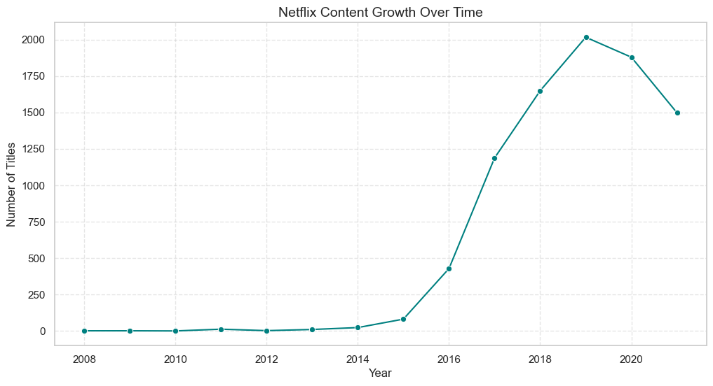
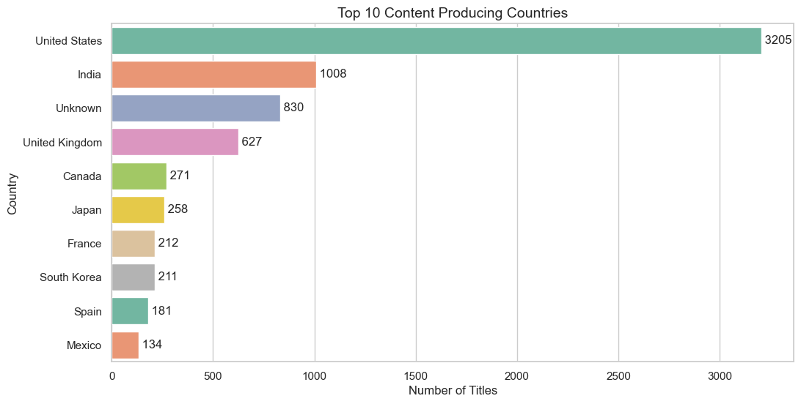
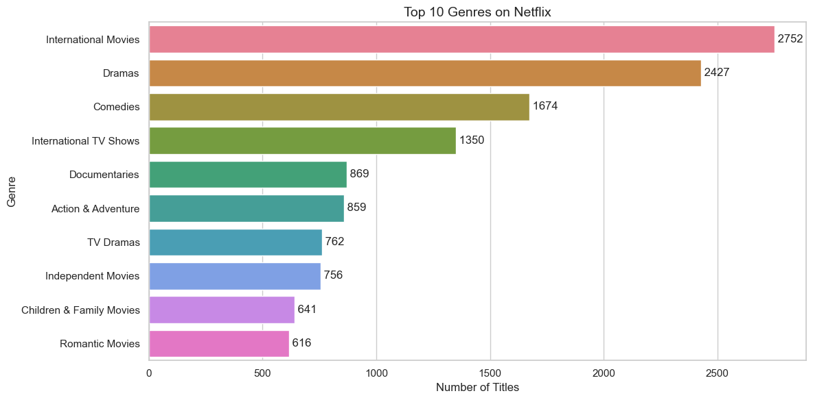
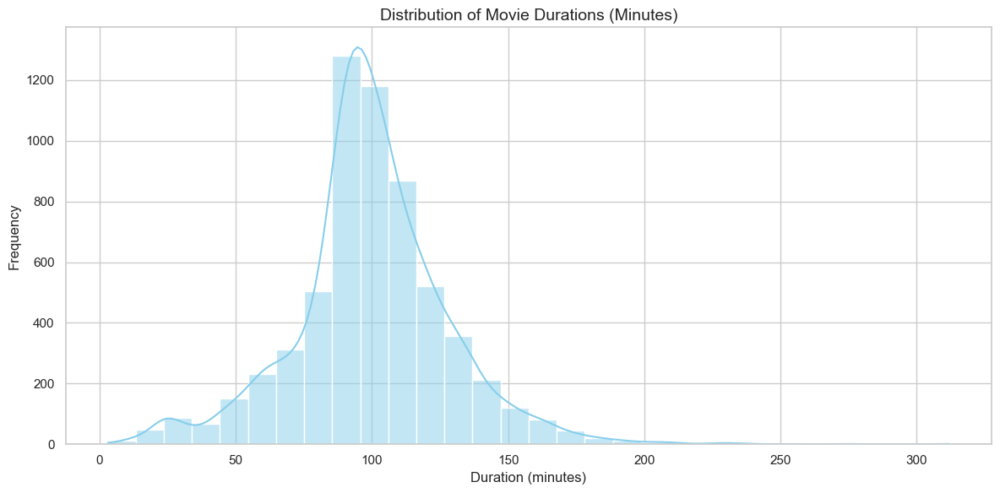

# 🎬 Netflix Content Strategy Analysis

## 📌 Overview

This project performs an in-depth exploratory data analysis (EDA) on Netflix Movies and TV Shows dataset to uncover patterns in content distribution, growth trends, and audience targeting.

---

## 🎯 Objectives

* Analyze distribution of Movies vs TV Shows
* Study content growth over time
* Identify top genres and producing countries
* Understand audience targeting through ratings
* Examine duration patterns of content

---

## 🛠️ Tech Stack

* **Python**
* **Pandas, NumPy**
* **Matplotlib, Seaborn**
* **Jupyter Notebook (VS Code)**

---

## 📊 Key Insights

* Netflix hosts more **Movies** than TV Shows
* Content addition increased sharply after **2015**
* **USA dominates** content production, followed by India
* **Drama & Comedy** are the most popular genres
* Majority content is rated **TV-MA & TV-14** (adult/teen focus)
* Most movies fall between **80–120 minutes**
* Most TV Shows have **1–2 seasons**

---

## 📈 Visual Analysis Includes

* Movies vs TV Shows distribution
* Content growth trend (line chart with markers)
* Top countries (horizontal bar chart)
* Genre analysis (exploded dataset)
* Ratings distribution (multi-color categorical plot)
* Duration analysis (movies & TV shows)

---

## 📂 Dataset

Netflix Movies and TV Shows Dataset (Kaggle)

---

## 🚀 Conclusion

Netflix has rapidly expanded its content library, especially post-2015, focusing on globally diverse and audience-targeted content. The platform emphasizes short-duration movies and limited-season TV shows, aligning with modern viewing behavior and engagement strategies.

---

## ⭐ Project Highlights

* Clean and structured EDA workflow
* Professional-grade visualizations
* Business-oriented insights
* GitHub-ready project structure

## 📸 Sample Visualizations

### 📈 Content Growth Over Time

### 🌍 Top Producing Countries

### 🎭 Genre Distribution

### ⏱️ Duration Analysis

